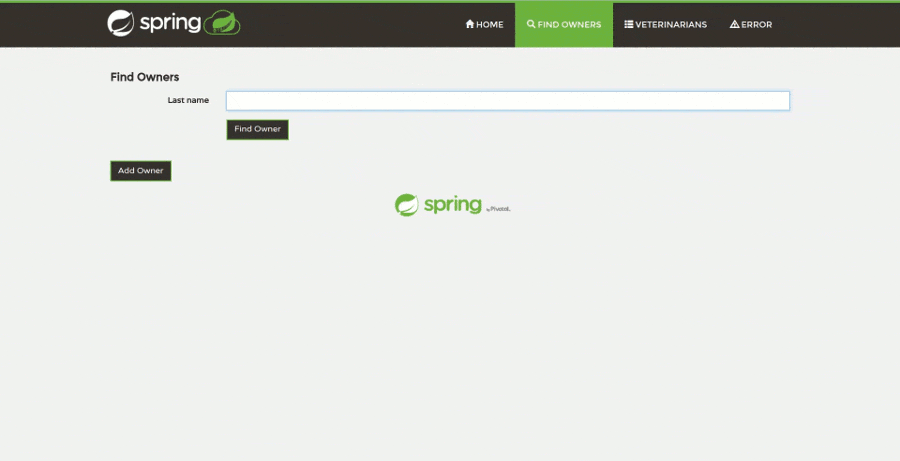

== Why?
Quick answer is that we did not find any java profiler with reasonable price, active development / support
and human-friendly profiling results delivery. Check our link:user-guide/home[User Guide] for more explanations.

== What exactly is hoopoe?
Hoopoe is a java agent deployed to JVM of profiled application. It instruments the code to trace its execution.
It supports plugins and extensions. Out-of-the-box we have a plugin to track SQL queries and extension
to provide Web-UI. Hoopoe is not a standalone application. Every profiled java process
will bring new hoopoe instance up.

== Where are we now?
Currently we are in alpha-version. This means two things: firstly, the absolute minimum set
of features is developed and is under active real-life testing; secondly, early adopters
 are welcome as well as any constructive critics and contributions.
link:user-guide/roadmap[Our roadmap] explains the plans of future development.

== Requirements

The only requirement is Java 8.

== Installation
. Download https://bintray.com/orange-buffalo/hoopoe-profiler/hoopoe-profiler/_latestVersion[the latest release].
. Register the agent for your application: `-javaagent:<path-to-hoopoe-agent.jar>`
* If you are using JBoss servers (AS, WildFly, EAP), please check link:user-guide/installation-guide[additional
instructions].
. Start the application.
. The web-ui for hoopoe-profiler is deployed at http://localhost:9786/[http://localhost:9786/,window=_blank].

Hoopoe can be configured in a flexible manner. Please check our link:user-guide/configuration-guide[Configuration Guide]
for more details.

NOTE: We instrument a lot of code to give the best profiling results we can.
It means the time to load any class will increase, as well as the total startup time of the application.

== Full list of features
* Code execution tracking
* SQL queries tracking
* Web-UI to display profiling results
* Hot Spots calculation and display in Web-UI
* More to come soon!

== Credits
We want to thank the community for all the pieces of code we use.
Special thanks to Rafael Winterhalter and his amazing http://bytebuddy.net[Byte Buddy,window=_blank],
which makes java code instrumentation a lot much easier and pleasurable.
